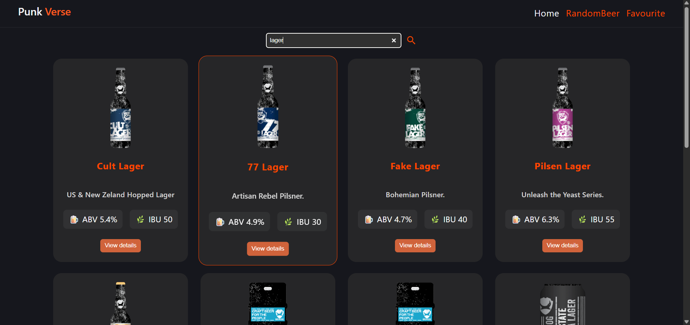

# Punk Verse 🍺

Punk Verse is a modern React-based beer explorer app built using the Punk API 🍻

The application allows users to browse and search beers while viewing detailed beer information including:

- 🍺 Beer name
- ✨ Tagline
- 📖 Description
- 📊 ABV (Alcohol By Volume)
- 🌿 IBU (Bitterness)
- 🧪 Ingredients
- 🍽️ Food pairings
- ⚙️ Brewing information

This project also helped me learn and practice:

- 🔗 API integration
- ⚛️ React fundamentals
- 📡 Fetching data using Axios
- 🔍 Search functionality
- 🎨 Responsive UI design
- 🧩 Component-based architecture

The project focuses on creating a clean, responsive, and visually engaging UI using React ⚛️ and modern CSS 🎨

## 🛠️ Built With

- React
- React Router
- Axios
- CSS
- React Icons

---

## 📦 API Used

This project uses the Punk API:

https://github.com/alxiw/punkapi.git

API Base URL:

https://punkapi-alxiw.amvera.io/v3/

---

## 📸 Preview



---

## ⚙️ Installation

Clone the repository:

```bash
git clone https://github.com/Akshitha-Mothkur/punk-verse.git
```

Move into the project folder:

```bash
cd punk-verse
```

Install dependencies:

```bash
npm install
```

Run the development server:

```bash
npm run dev
```

## 👩‍💻 Author

Akshitha
